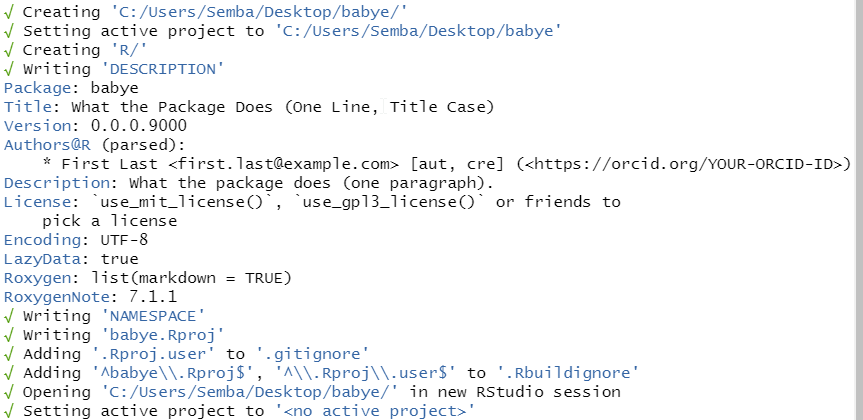
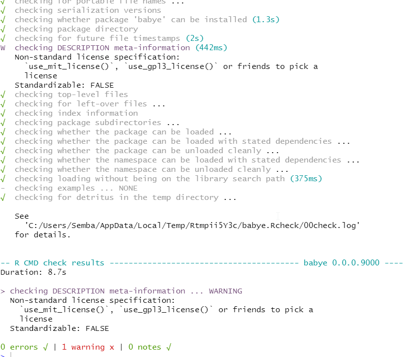
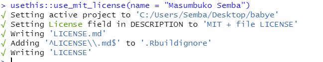
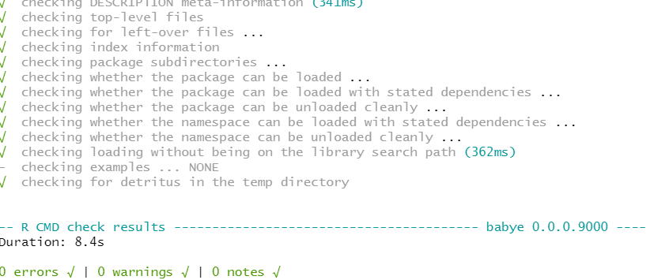

# R package


```{r setup2, include=FALSE}
knitr::opts_chunk$set(echo = TRUE)
```

When you need to develop a package, you need some tools for that task. Since I am going to illustrate to develop R package inside Rstudio, you ought to know some basic tools required to accomplish the task. Table \@ref(tab:tab21) shows the package you need to install them to be able to work smoothly on package development. The version of the software or package is also shown in table \@ref(tab:tab21) for you to check the version you have in your machine and whether you need to update them.

```{r tab21, echo=FALSE}
require(magrittr)

tibble::tibble(software_package = c("**R**", "**Rstudio**", "`devtools`", "`usethis`", 
                                    "`tidyverse`","`rlang`", "`broom`"), 
               Version = c("4.0.3", "1.4", "2.3.2", "1.6.3", "1.3.0", 
                           "0.4.8", "0.7.1")) %>%
  kableExtra::kable(col.names = c("Software/Package", "Version"), 
                    caption = "Software and Packages") 
```

R package development has become substantially easier in recent years with the introduction of a packages like **devtools** [@devtools] and **usethis** [@usethis]. These packages includes a variety of functions that facilitate software development in R. During package development stages, you will find that some functions you use once (single use) and others are used several times (multiple usage). Table \@ref(tab:tab22) highlights some functions and whether are single used and multiple uses during package development

```{r tab22, echo=FALSE}
tibble::tibble(Function = c("`usethis::create_package()`", 
                            "`usethis::use_mit_license()`", 
                            "`usethis::use_pipe()`",
                            "`devtools::check()`", 
                            "`devtools::load_all()`", 
                            "`usethis::use_r()`",
                            '`usethis::use_package()`',
                            '`devtools::document()`'),
               usage = c("Single",
                         "Single",
                         "Single",
                         'Multiple',
                         'Multiple',
                         'Multiple',
                         'Multiple',
                         'Multiple'),
               Purpose = c("Initialize package", 
                           "Add license to package", 
                           "Add pipe function as dependency", "build package locally and check", "load functions into memory", "create R script for function", "add package dependency", "build and add documentation")) %>%
  kableExtra::kable(caption = "Single and multiple usage of functions")
```


## Package Development
We begin our package development using the function `usethis::create_package()`, which basically initialize the package development. 

```{r, eval=FALSE}
usethis::create_package(path = "c:/Users/Semba/Desktop/babye")
```

This function create an R project with an environment for package development in a location you specified. For this case I have created a package named **babye** on my desktop. The step-by-step of the process is shown in figure \@ref(fig:fig21)

```{r fig21, echo=FALSE, fig.keep='high', dev='png', out.width='100%', fig.cap="package development"}

```

Now that we have a package. let's check it. The function `devtools::check` was developed for this task as it updates the package documentation, build the package and submit over 50 checks for metadata, structure, R code, documentation and more. This can take a while to run, depending on how big your package is. It is helpful to run frequently, especially if you are planning on submitting to CRAN. But even for internal packages, it is still good practice. A screenshot of our first check is shown in figure \@ref(fig:fig22) and spotted a single warning that our package needs a license in the DESCRIPTION file

```{r fig22, echo=FALSE, out.width="100%", fig.cap="Check the package functions"}

```
We can fix this error by simply add a license on the package project folder. A standard recommendation is the MIT license because of its widely usage and permissions. 

```{r, eval=FALSE}
usethis::use_mit_license(name = "Masumbuko Semba")
```

Once we run the `usethis::use_mit_license(name = "Masumbuko Semba")` in the command line, it updates the description file  and creates two new license files in the project folder (see figure \@ref(fig:fig23)). It is recommended that the two licenses files never edited. 

```{r fig23, echo=FALSE, out.width="100%", fig.cap="Package license"}

```

Though the tools have added key parts of the DESCTIPTION file, you need to open it and complete the remaining parts and updates the fields with descriptive information. Once you have done that you can re-submit with `devtools::check()`

```{r, echo=FALSE, out.width="100%", fig.cap="Package free of error"}

```

We notice that our package is error-free


