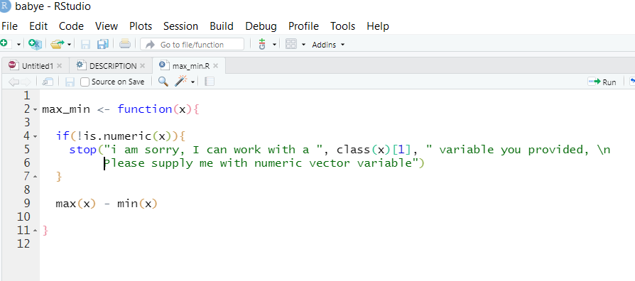
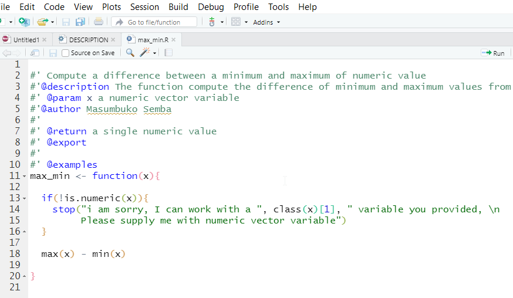
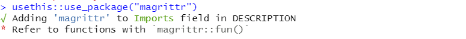

# Functions

As mentioned in previous chapter, R packages bundles functions so that are ready and easy available for users. That tells us that the core ingredients of R packages are functions. R packages contains several functions that together make a packages that is aimed to facilitate data import, manipulation and plotting within R environment [@R-base]. Therefore, in this chapter we are going to learn how to make a simple function that work. We are not going to load with you with creating many functions, but we understand that once you master the basic of creating your own function, it will be easy to make more function that are intended to solve a particular data science probem.

```{r setup3, include=FALSE}
knitr::opts_chunk$set(echo = TRUE)
```


We create a function and assign it a name `max_min`. This function aim to find the difference of numeric values in a vector. 

```{r}
max_min <- function(x){
  max(x) - min(x)
}
```

Let's check whether the function work using the famous iris dataset. We only check the difference of variable `Sepal.Length`

```{r}
max_min(x = iris$Sepal.Length)
```

That work, what if we use a `Species` variable

```{r, eval=FALSE}
max_min(x = iris$Species)
```
We get an error, but the message isn't descriptive. That is common. For us to make descriptive notification when a wrong type of data is provided, we need to add the `if-stop` function to validity the arguments that are required in the function. We recreate the function and additional arguments to check the validity of the arguments. 

```{r}

max_min <- function(x){
  
    if(!is.numeric(x)){
      stop("i am sorry, I can work with a ", class(x)[1], " variable you provided, Please supply me with numeric vector variable")
    }
  
  max(x) - min(x)
  
}
```

Let's check again the variables species in our functions.
```{r, eval=FALSE}
max_min(x = iris$Species)


```
Woolah! now we get a descriptive error notification, what if we supply the numeric variable to the function!

```{r}
max_min(iris$Sepal.Width)
```

Let us add our first function `max_min` to **babye** package using `usethis::use_r("max_min"). This creates a black R script named `max_min.R` located in the `R/` sub-folder in our package directory. It is recommended that the R script and the function bear the same name. Then fill the R script of R function we created with the argument as shown in figure \@ref(fig:fig31). 

```{r fig31, echo=FALSE, fig.cap="Function script", out.width="100%"}

```

Once you have created the function, take your function for a test drive with `devtools::load_all (“arguably the most important part of the devtools workflow”)`. `devtools::load_all()` places your function in local memory so that you may tinker and confirm its execution. Let’s give it a try.

## Document
Next document the `max_min` function using the Roxygen skeleton. The roxygen2 package provides an in-source documentation system that automatically generates R documentation (Rd) files. First, place your cursor in the function definition, and then you can add the skeleton from `code > insert Roxygen skeleton` in the Rstudio main tab (see figure \@ref(fig:fig32)).

```{r fig32, fig.cap="Inserting function documentation in Rstuido", out.width="100%"}
knitr::include_graphics("img/roxygen_skeleton.png")
```
You will get skeleton of documentation for the function, you can fill the field and updates it as you wish. This document the function and briefly describe it, which make it easy for you and user later that help instruct how to use the function. I have updated the `max_min` function as seen in figure \@ref(fig:fig33)

```{r fig33, echo=FALSE, out.width="100%", fig.cap="documented function"}

```

Once you have update the function document, save it and submit using the `devtools::document` function. 


## Dependencies
It’s the job of the DESCRIPTION to list the packages that your package needs to work. To specify a package dependency, the name of the package needs to be listed in the DESCRIPTION file. This can be automatically done for you by submitting. 

```{r fig34,fig.cap="Package dependency", out.width="100%", echo=FALSE}

```

We notice that our package to work with pipe operator, it requires a **magritrr** package [@R-magritrr]. That means when you install this package, it will also install the packages it depends like **magritrr**.


```{r fig35,fig.cap="Package dependency", out.width="100%", echo=FALSE}
knitr::include_graphics("img/package_dependency_description.png")
```


## Special Case
Although we have imported a **magritrr** package, this package has special operator called pipe or then denoted as `%>%`, which provide a convenient way to chain the processes in R.  We can add this special function in two steps

+ `usethis::use_pipe()`---which creates `utils-pipe.R` folder and adds `magritrr` to imports in the DESCRIPTION file.
+ `devtools::document()`---add the pipe in our package NAMESPACE file. 

